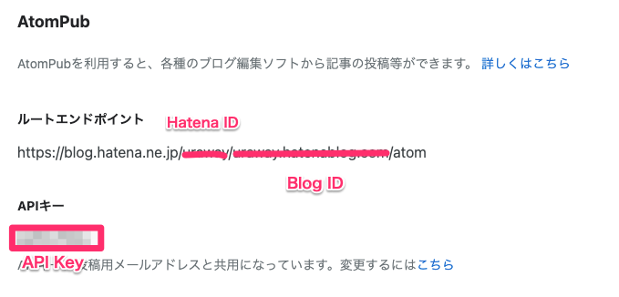
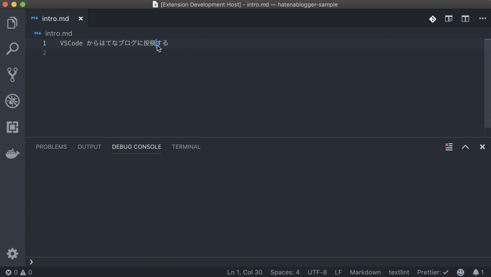
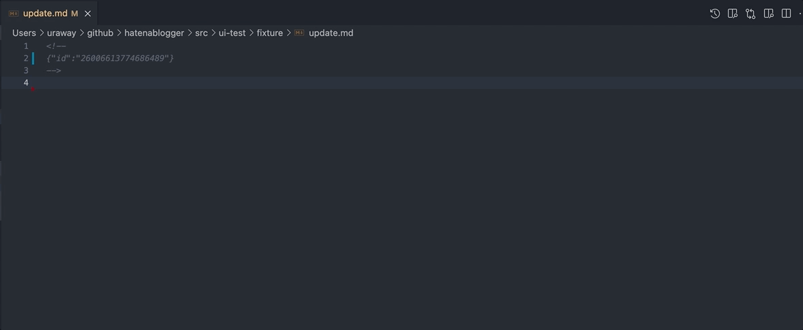
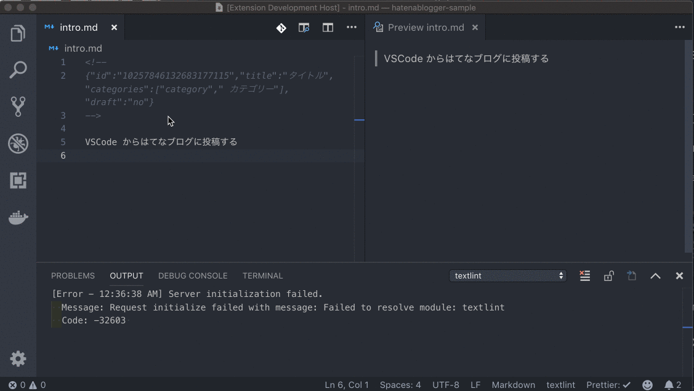

# hatenablogger

This VSCode extension helps you to manage entries on HatenaBlog and images on HatenaFotolife.

はてなブログエントリーを VSCode から投稿・更新するための VSCode 拡張です。はてなフォトライフへ画像をアップロードすることもできます。

## オプション設定

| プロパティ | 型     | 必須 | 説明                                                                              |
| ---------- | ------ | ---- | --------------------------------------------------------------------------------- |
| hatenaId   | 文字列 | ○    | Hatena ID                                                                         |
| blogId     | 文字列 | ○    | [Blog ID](http://blog.hatena.ne.jp/my/config/detail) (デフォルトはブログドメイン) |
| apiKey     | 文字列 | ○    | [API キー](http://blog.hatena.ne.jp/my/config/detail)                             |

| プロパティ       | 型     | 必須 | 説明                                                         |
| ---------------- | ------ | ---- | ------------------------------------------------------------ |
| fotolifeFolder   | 文字列 |      | 画像をアップロードするフォルダを指定します                   |
| alwaysAskCaption | 真偽値 |      | 画像をアップロードする際に、キャプションを追加するか尋ねます |

## 機能

### エントリの投稿: `Hatenablogger: Post or Update`

マークダウンファイル内にコンテキストコメントがない場合は、エントリを投稿し、コンテキストコメントを挿入します

### エントリの更新: `Hatenablogger: Post or Update`

マークダウンファイル内にコンテキストコメントが存在する場合は、エントリとコンテキストコメントを更新します

### エントリの取得: `Hatenablogger: Retrieve Entry`

マークダウンファイル内にコンテキストコメントが存在する場合は、エントリを取得し、マークダウンファイルとコンテキストコメントを同期します

### イメージのアップロード: `Hatenablogger: Upload Image`

はてなフォトライフへ画像をアップロードし、マークダウン形式で画像 URL を挿入します

## Contributing

1. Fork this repo and Clone it!
2. Commit and Push your changes.
3. If you contributed something new, run yarn contrib:add <your GitHub username>
4. Finally submit a pull request :D

## Contributors

Thanks goes to these wonderful people ([emoji key](https://allcontributors.org/docs/en/emoji-key)):

<!-- ALL-CONTRIBUTORS-LIST:START - Do not remove or modify this section -->
<!-- prettier-ignore -->
<table><tr><td align="center"><a href="http://uraway.hatenablog.com/"> <b>Masato Urai (@uraway_)</b></a> <a href="https://github.com/uraway/hatenablogger/commits?author=uraway" title="Documentation">📖</a> <a href="https://github.com/uraway/hatenablogger/commits?author=uraway" title="Code">💻</a></td></tr></table>

<!-- ALL-CONTRIBUTORS-LIST:END -->

This project follows the [all-contributors](https://github.com/all-contributors/all-contributors) specification. Contributions of any kind welcome!
