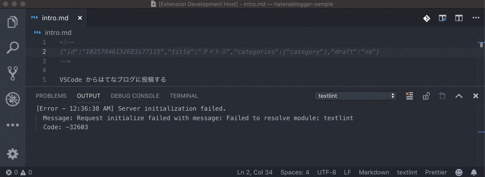

# hatenablogger

This VSCode extension helps you to manage entries on HatenaBlog and images on HatenaFotolife.

[日本語の解説エントリはこちら](http://uraway.hatenablog.com/entry/2018/12/12/001545)

## Features

### Post an entry

Post an entry and create a context: `Hatenablogger: Post or Update`

### Update an entry

If a context exists, try to update the entry: `Hatenablogger: Post or Update`

### Upload Image

Upload image to fotolife and insert image url: `Hatenablogger: Upload Image`

## Extension Settings

- `hatenablogger.hatenaId`: your Hatena ID
- `hatenablogger.blogId`: [your Blog ID](http://blog.hatena.ne.jp/my/config)
- `hatenablogger.apiKey`: [your API Key](http://blog.hatena.ne.jp/my/config/detail)

